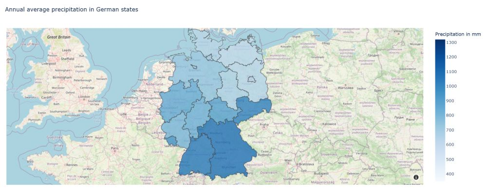

### Choropleth maps use color-differences to visualize how a variable differs across a geographic area. The interactive maps also show variations over time.  
\
The notebook can be opend in [Google Colab](https://colab.research.google.com/github/to-schi/choropleth-maps/blob/main/choropleth-maps_weather_ger.ipynb).

